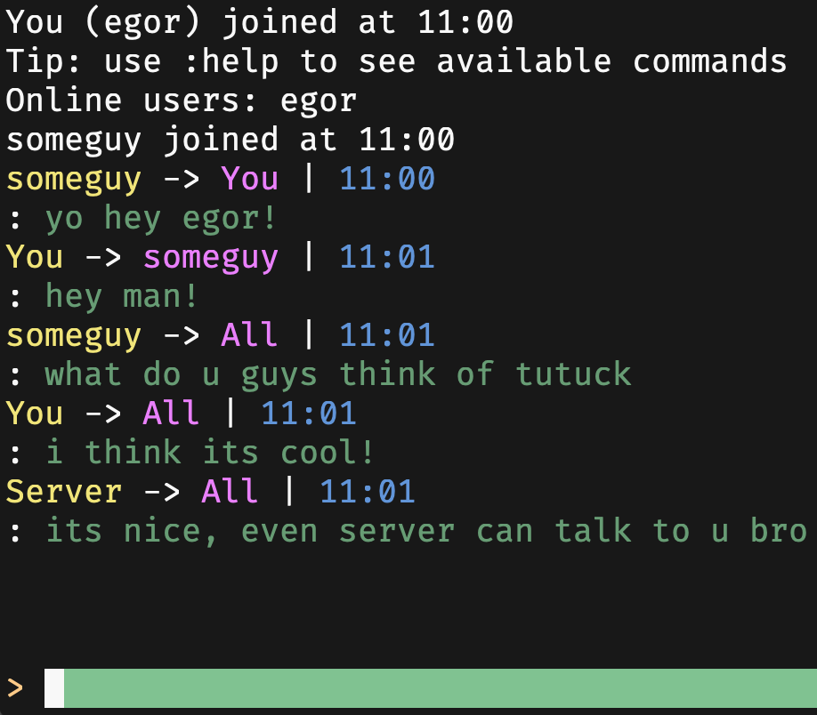

# TuTuck - the messanger, right in terminal, via ssh!

<a href="https://www.producthunt.com/products/tutuck?embed=true&utm_source=badge-featured&utm_medium=badge&utm_source=badge-tutuck" target="_blank"></a>
[](https://www.gnu.org/licenses/gpl-3.0)

Have you ever thought about to chat right in terminal? When coding?... No? Its just time! TuTuck allows to do it, lets see whats it in general.



#### Feel free to contribute! 

# Why TuTuck? What's so special about it? 
Here are 3 reasons to choose TuTuck for your team: 
- TuTuck works via CLI and TUI clients, so you can choose what you like.
- It has sessions system - you can write to user only when he's online, so the zero log system works. Messages are just getting dropped right when you and your friend leave TuTuck.
- Authentication is made via SSH keys, that guarantees one of the safest and most popular auth system.

But since you are still here, I guess you havent found the killer-feature for you in TuTuck... well, TuTuck has some more features!

The main problem of an app was to leave it somewhere between security and simplicity, hope we did it just as it should be :)

> [!IMPORTANT]  
> Note that TuTuck does not have any encryption except ssh for now, adding messages enctyption is #1 issue for now, will be soon
 
## Install

Install it via GoLang package manager

#### Server
```sh
go install github.com/fynjirby/tutuck/server@latest
```
#### CLI client
```sh
go install github.com/fynjirby/tutuck/client/cli@latest
```
#### TUI client
```sh
go install github.com/fynjirby/tutuck/client/tui@latest
```

> [!NOTE]  
> Bins will be named as server, cli and tui. You can rename them if you want, they align in `~/go/bin/`

#### Manual way
Go to [releases](https://github.com/Fynjirby/tutuck/releases/) and download the binary you need for your OS, then move it to `/usr/local/bin/` or any other directory in your `$PATH`

## Building
- Install [Go](https://go.dev/) and make sure it's working with `go version`
- Clone repo
- Run `go build` in repo directory, then move the built binary to `/usr/local/bin/` or any other directory in your `$PATH`
